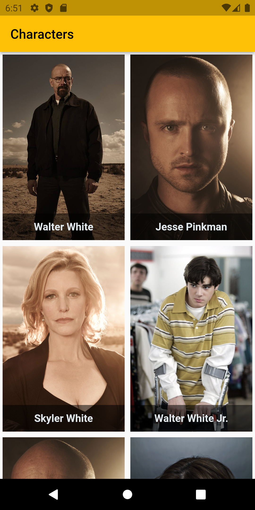
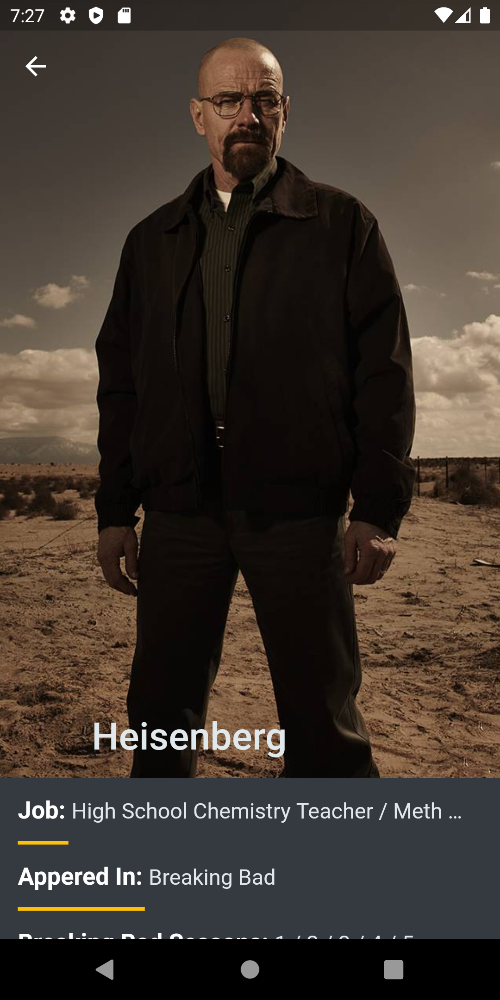
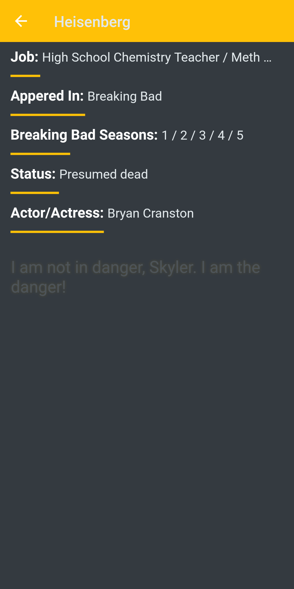
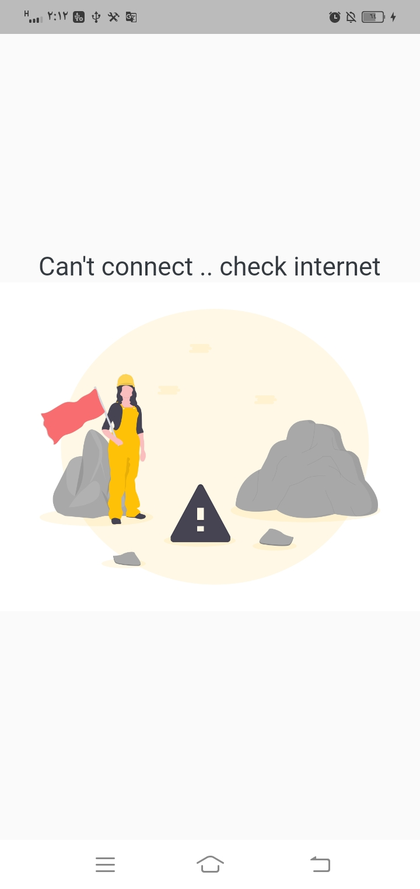

# Breaking Bad 

A new Flutter project using Bloc with little animation.

## Free Api: https://breakingbadapi.com/documentation

### Screen Shots:
 
 

# Features:

- Using Modular Bloc Architecture, Custom widgets and Clean reusable code.
- Using Bloc(Cubit) as a state management.
- Using little Animation.
